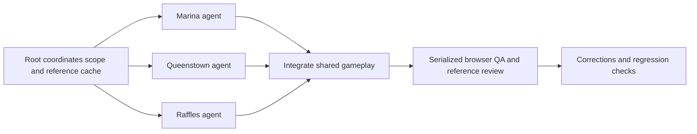
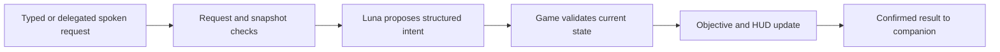

# Agentic engineering: parallel world building and verified corrections

[How we built it](BUILD-STORY.md) · [Verification record](evidence/verification.md)

## Astra-assisted development workflow

The strongest category example is the development process: the team used Astra to coordinate region work, interpret references, integrate shared game systems, diagnose failures, and verify corrections. [PLAN.md](../PLAN.md#expanded-scope-larger-maps-and-large-reference-batches-for-all-three-regions) records three modeling agents, one per region, with a camera-QA agent reassigned after its checks. Modeling proceeded in parallel; browser capture, reference selection, and visual QA used a serialized queue because they shared Chrome's foreground state.



### A concrete failure and correction

**Before:** dragging the driving camera changed the yaw used to move the car, so looking around could steer it. **After:** camera orbit and vehicle heading are separate; vertical orbit is clamped, stationary views persist, and movement recenters the view after an idle delay. Commit `ef1ddfb` records the integrated correction. [drive-camera.ts](../src/game/drive-camera.ts) contains the shared implementation; [drive-camera.test.ts](../src/game/drive-camera.test.ts) protects orbit, clamping and damping behavior.

A second failure affected the visual inputs: browser metadata could update while background panorama pixels remained stale. The [development record](../PLAN.md#earlier-milestone-raffles-place-richer-queenstown-and-independent-car-camera) describes foreground/POV checks, overlay rejection, animation-frame warm-up and duplicate detection. [Capture readiness tests](../src/game/capture-readiness.test.ts) cover readiness conditions. Manual visual acceptance remains necessary because changing UI pixels can hide a stale panorama from simple duplicate checks.

This illustrates why the workflow used both parallel agents and serialized shared resources. The records describe team/model participation; the code and Git diffs independently establish the implementation. They do not recover every agent prompt or prove authorship of each line.

### Inspect the development sequence

Times below are Git committer times on 13 September 2026, SGT. The team reports that the submission deadline was extended to end of day; these times provide traceability, not proof of the exact submitted or deployed revision.

| Commit | Time | Inspectable outcome |
| --- | --- | --- |
| `ef1ddfb` | 12:54 | Expanded regions and independent driving camera. |
| `2f27af2` | 13:30 | Reference-informed model refinements and recorded image reviews. |
| `5a30c9f` | 14:12 | Adventure companion and educational guide. |
| `cf3d02f` | 14:52 | Current Luna text interpretation. |
| `ca47a25` | 16:22 | Native Node import correction and regression test. |
| `ecf5469` | 16:51 | Companion input safeguards. |

```sh
git show ef1ddfb -- src/game/drive-camera.ts src/game/drive-camera.test.ts scripts/capture-readiness.mjs
git show 2f27af2 -- src/game/marina-scene.ts src/game/queenstown-scene.ts src/game/raffles-scene.ts
```

The current review reran **19 tests across five camera, capture-readiness and regional-scene files**. These cover camera behavior, capture readiness, scene structure, road clearance and collectible reachability. They support the workflow's outcomes; they do not evaluate visual resemblance or replace a human play-through.

## Runtime companion: request to verified game action

In Marina 3D, “take me to the museum” selects the existing Lotus museum objective. “Give me something closer” selects a nearer uncollected objective, evaluated from the player's current position. The HUD and minimap update without clearing previously collected stamps.



## Responsibility boundaries

| Stage | Implementation | Evidence |
| --- | --- | --- |
| Inputs | [Companion panel](../src/components/AdventureCompanion.tsx), [voice transport](../src/lib/live-voice.ts) | Text and spoken requests converge on the client; typing stays separate from game controls. |
| Interpretation | [API handler](../server/adventure-api.ts), [input safeguards](../server/adventure-security.ts) | Server validates requests and constrains model output to known actions, destinations, and learning topics. |
| Application | [Adventure state](../src/game/adventure.ts) | Session, revision, and request guards reject stale proposals. “Closer” is recalculated locally at apply time. |
| Confirmation | [Client](../src/lib/adventure-client.ts) | Success text comes from `game.apply`, after mutation. Superseded network responses are ignored even if transport cancellation fails. |
| Visible feedback | [Marina controller](../src/components/MarinaGame.tsx), [objective highlight](../src/game/objective-highlight.ts) | The active ID drives the visible objective; arrival/collection remains in the game loop. |

“Closer” means straight-line distance in game coordinates, not a computed walking route. No model invents a new coordinate, awards a stamp, or controls the physics loop. Queenstown and Raffles Place companions are educational; their questions do not change exploration progress.

## Recorded implementation and correction

The repository establishes this sequence:

1. Commit `5a30c9f` added the adventure companion and educational guide.
2. Commit `cf3d02f` changed companion text interpretation to Luna. Older passages in [ADVENTURE.md](../ADVENTURE.md) still describe the initial Astra backend; the current server configuration is authoritative.
3. Commit `ca47a25` corrected the import of `random-id` in `adventure.ts` to include `.ts`, and added [native-import.test.ts](../server/native-import.test.ts). This addresses a real distinction: Vite/Vitest resolution can accept imports that native Node ESM cannot load.
4. Commit `ecf5469` added companion input safeguards and regression cases for rejected/throttled requests. See [security design](COMPANION-SECURITY.md).

Inspect the actual diffs:

```sh
git show --stat 5a30c9f
git show ca47a25 -- src/game/adventure.ts server/native-import.test.ts
git show ecf5469 -- server/adventure-security.ts src/lib/adventure-client.test.ts
```

This is evidence of implementation, correction, and regression protection. The native-import test now launches Node with the same type-stripping loader used by the server and imports its dependency graph. It passed in this review. We did not recover an original failing-run log or agent transcript, so we do not present a reconstructed conversation or claim which individual edit the model authored. The team's Astra usage is documented in README/PLAN; Git history establishes the resulting code changes.

## What the tests demonstrate

- [Adventure tests](../src/game/adventure.test.ts): named/closer/skip behavior, stamp preservation, invalid destinations, exhausted alternatives, and stale proposals after newer requests, reset, collection, or disposal.
- [Client tests](../src/lib/adventure-client.test.ts): confirmation after application, learning without progress mutation, canceled/superseded requests, and useful error handling.
- [API tests](../server/adventure-api.test.ts) and [security tests](../server/adventure-security.test.ts): request/output validation and bounded input handling using mocked network responses.
- [Voice tests](../src/lib/live-voice.test.ts): transcript/delegation and cleanup behavior with test doubles, not human audio evaluation.
- [Native import test](../server/native-import.test.ts): the actual Node loader can load the server dependency graph.

The [verification record](evidence/verification.md) contains the commands and results: 66 focused tests passed: 19 world/camera/capture tests and 47 companion/server tests. A subsequent verification rerun passed the complete 200-test suite, TypeScript compilation and the Sites production build. Live model calls and public deployment were not reverified.
