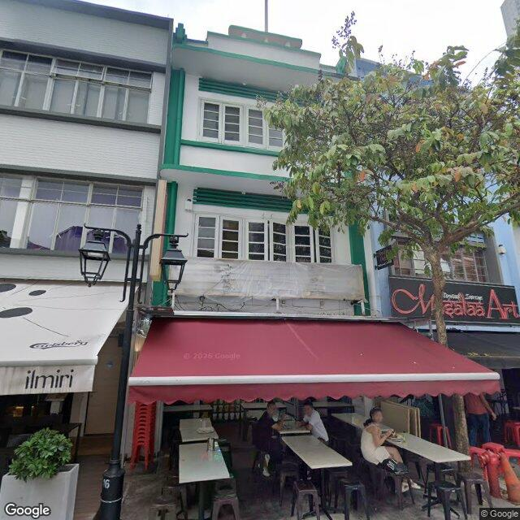
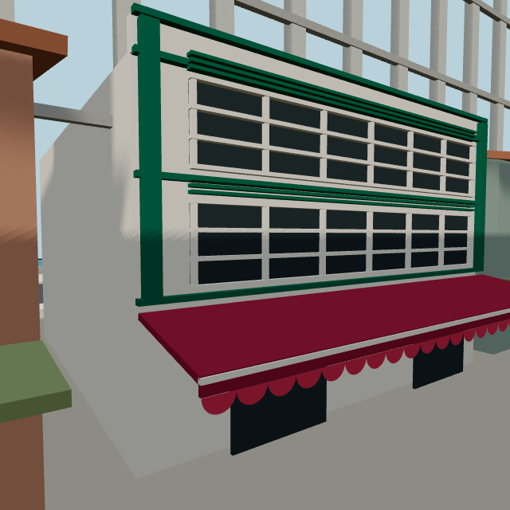

# Raffles Place: a recorded visual refinement

[Build story](BUILD-STORY.md) · [Visual comparisons](visual-understanding.md)

This new iteration addresses the independent review's weakest visual example: a quay facade with only one window row and a tan wall. In the current Astra-assisted Codex session, we inspected newly captured Google Street View images, recorded observations before editing, changed one facade, and compared matching-camera renders. It is a new development record, not a reconstruction of an earlier model conversation.

## Reference → observation → correction

Google Street View Static API; original attribution retained. The panorama's source date and credit are preserved in [metadata](../reconstruction/raffles-place/references/refinement-02-quay-context.json). The five quay views reuse one cached panorama with different camera settings; they do not provide independent viewpoints or measured depth.

| Observed feature | Before | Implemented correction |
| --- | --- | --- |
| Two stacked upper window bands | One row of two shutter openings | Two rows of white-framed windows with dark panes. |
| White wall panels and green trim | Tan wall with green shutters | White facade, green side pilasters and horizontal bands. |
| Green ventilation slats over each row | Pale bars across shutters | Separate green slats above both window bands. |
| Sloped red awning with pale rail and scalloped edge | Flat red canopy | Sloped canopy, pale leading rail and repeated scallops. |
| Front parapet silhouette | Exposed pitched terracotta roof | Low front parapet; the unseen real roof remains unspecified. |

## Matching-camera comparison

| Before | After |
| --- | --- |
|  |  |

Both renders use camera `[-139, 6, -69]`, target `[-128, 5, -85]`, 65° FOV, 640 × 640 output, and animation time zero. The top/right framing is cropped in both; the two window rows and canopy remain visible. These are actual scene-builder renders, not generated concept images. [Before settings](evidence/raffles-refinement/before-settings.json) · [After settings](evidence/raffles-refinement/after-settings.json).

The selected building remains at x=-128, z=-87 with its existing ground footprint and obstacle. Roads, spawn and collectible locations were not changed. Geometry uses the existing batching system. Proportions are compressed, the right-hand reference bays are partly tree-occluded, and neighboring buildings remain authored. The change improves specific visible features; it does not establish surveyed accuracy.

## Inspect the actual iteration

- [Session record](evidence/raffles-refinement/session-record.md): actual user task, observations recorded before the edit, and acceptance criteria. This is a contemporaneous development record; it is not a raw API transcript and has no API response ID.
- [Scene diff](evidence/raffles-refinement/scene-change.patch) and [implementation](../src/game/raffles-scene.ts): inspect the exact correction against baseline `19ba0c7`.
- [Per-image observations and hashes](evidence/raffles-refinement/reference-review.json): all 25 images were opened and reviewed; 23 accepted for stated details, two limited. Only the quay subset drives this targeted correction; the other district details are retained as reviewed references.
- [Capture plan](../reconstruction/raffles-refinement-02-plan.json) and [usage ledger](../reconstruction/api-usage.json): 25 successful new images, zero failures, zero metadata requests. History retained; aggregate Static attempts are now 130/1000, and this additional 25-image allowance is exhausted.
- [Artifact hashes](evidence/raffles-refinement/artifacts.json): before/after images, settings, observations and code diff.

## Validation

The matching-camera after image was directly inspected: both window rows, white/green contrast, separate ventilation slats, canopy slope, pale leading rail and scalloped edge are visible. The four existing Raffles scene tests passed, including road clearance and drive reachability to all eleven stamps. The complete suite passed **200 tests across 41 files**; TypeScript compilation and the Sites production build passed with the existing bundle-size warning. [Test output](evidence/raffles-refinement/tests.txt) · [Build output](evidence/raffles-refinement/build.txt).

The cache-only plan preview reports 25 cached images, zero new images and zero metadata requests. Full reference inventory and browser results are recorded in the [verification record](evidence/verification.md). No demo video or narration was changed.
