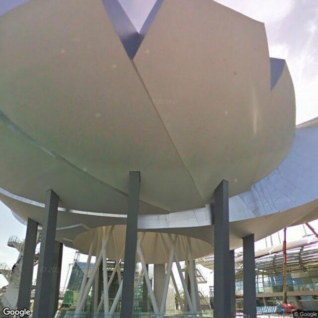
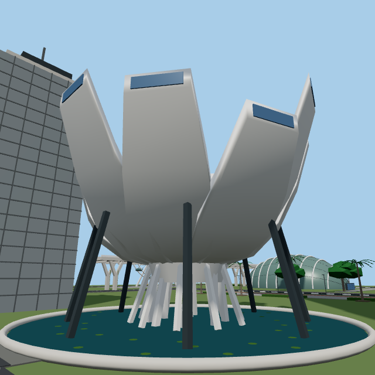
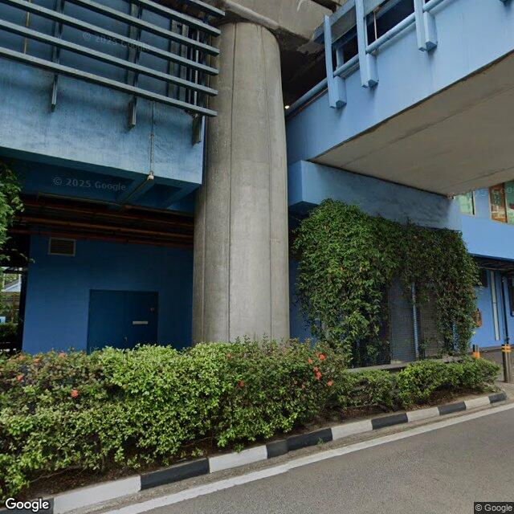
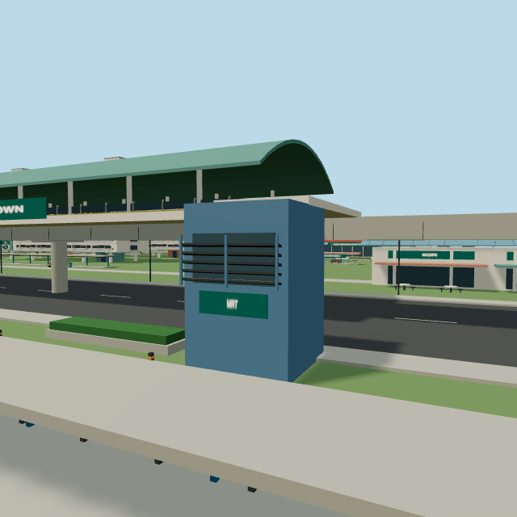
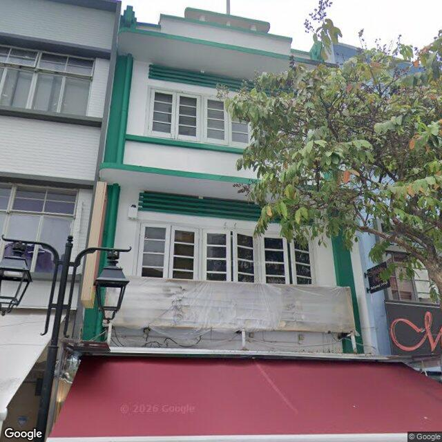
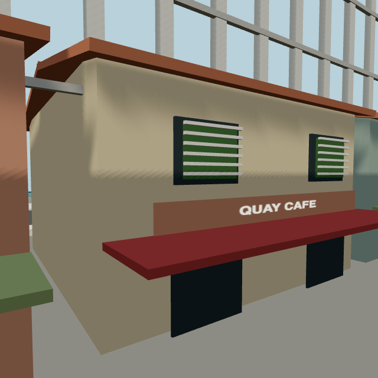

# Visual understanding: references to playable environments

[How we built it](BUILD-STORY.md) · [Verification record](evidence/verification.md)

These comparisons show how specific visible features in Google Maps Street View references correspond to authored game geometry. Each source is an existing, reviewed cache image; no new Google imagery was requested. Original images retain their attribution and are linked rather than duplicated.

The right-hand images are new renders of the **current game scene builders**, using fixed documentation cameras to expose the relevant details. They are not matched/calibrated camera reconstructions or screenshots of a player's movement. [Capture settings](evidence/render-settings.json) and the [reproduction script](evidence/capture-project-evidence.mjs) make the framing explicit.

## Iteration and hackathon scope

The workflow supports progressive refinement: additional useful reference images can reveal details that earlier views obscured, and successive Astra-assisted modeling, comparison and correction passes can improve visual fidelity. The museum's support refinements below provide a concrete example. Improvement depends on reference quality and review, rather than image count alone.

The team reports that **Marina Bay received the most iterations within the hackathon's limited time**. Queenstown and Raffles Place received fewer refinement passes, which helps explain the uneven detail across the three regions. The [development history](../PLAN.md) records successive regional expansion and reference-quality passes. These comparisons show the results reached within that time budget; further reviewed references and targeted iterations offer a path to improve the remaining mismatches, without guaranteeing exact reconstruction.

## Marina Bay — museum shell and supports

| Google Street View reference | Current Marina scene geometry |
| --- | --- |
|  |  |

**Provenance:** Google Street View Static API, owner-authorized reference; source imagery **February 2012**, captured **13 September 2026**; metadata credit **© 2026 Google**, with original image attribution preserved. [Metadata and review](../reconstruction/marina-bay/references/marina-static-quality-museum-petals.json). Accepted for white concave shell undersides and the contrast between dark outer struts and pale inner angled supports.

**Visible translation:** the model retains the upward-opening petal silhouette, the light shell/dark support contrast, and a separate pale inner support cluster. These are geometric elements, not a photograph pasted onto a flat background. Inspect the museum section in [marina-scene.ts](../src/game/marina-scene.ts).

**Limits:** the real shell's continuous curves are represented by angular surfaces; the model's petal tips, spacing, base, and neighbouring skyline are authored. This close-up does not establish footprint, exact dimensions, or the location of surrounding buildings. The source is historical, not proof of today's appearance.

**Documented iteration:** the [existing quality review](../reconstruction/marina-bay/references/static-quality-review.md) records adding dark outer struts while retaining white inner legs and authored petals. That review was introduced in commit `2f27af2`. It also marks the cropped SkyPark reference as limited and explicitly avoids deriving new dimensions from it. This supports selective use of visual evidence rather than treating every capture as equally reliable.

## Queenstown — station entrance detail

| Google Street View reference | Current Queenstown scene geometry |
| --- | --- |
|  |  |

**Provenance:** Google Street View Static API, owner-authorized reference; source imagery **March 2025**, captured **13 September 2026**; metadata credit **© 2026 Google**, with original image attribution preserved. [Metadata and review](../reconstruction/queenstown/references/static-quality-station-front.json). Accepted for blue fascia, projecting dark louvers, pale rounded pier, and hedge; its stated scope is entrance massing only.

**Visible translation:** blue entrance cladding and projecting dark horizontal louvers remain legible in the model. The screenshot also shows the elevated railway, pale supports and covered-path composition. The latter context belongs to the broader authored region; this one entrance close-up does not independently substantiate the whole station. Inspect the entrance/louver and railway sections of [queenstown-scene.ts](../src/game/queenstown-scene.ts).

**Limits:** the entrance becomes a compact blue cuboid; planting is simplified into blocks, and support placement differs. The source's rounded pier, weathering, and climbing foliage are not reproduced with photographic fidelity. The roof, railway extent and street layout cannot be inferred from this crop alone.

## Raffles Place — shophouse facade language

| Google Street View reference | Current Raffles scene geometry |
| --- | --- |
|  |  |

**Provenance:** Google Street View Static API, owner-authorized reference; source imagery **March 2024**, captured **13 September 2026**; metadata credit **© 2026 Google**, with original image attribution preserved. [Metadata and review](../reconstruction/raffles-place/references/static-quality-quay-facade.json). Accepted as a clear outdoor detail reference; its stated purpose is green/white trim and upper window bands. The visible tree still obscures part of the facade.

**Visible translation:** narrow frontage, green window/shutter panels, pale horizontal bars and a projecting red awning provide a recognisable shophouse vocabulary. Inspect the quay service-lane section in [raffles-scene.ts](../src/game/raffles-scene.ts).

**Limits:** this is not a replica of that business or building. The game uses a tan wall, fewer window groups, simplified storeys, a terracotta roof, and fictional shop signs. Its tall background grid and neighbouring buildings are part of the compressed game layout, not evidence supplied by this reference.

**Concrete improvement opportunity, not implemented:** preserve the reference's two stacked upper window bands and white panels with green trim in one selected facade, then compare again from the same documentation camera. Acceptance would require those bands and trim to be visible while retaining the existing footprint and collision bounds. The current screenshot exposes the mismatch; this document does not claim that correction has been made.

## Trace visual decisions to implementation

Commit `2f27af2` records the reference-quality pass. The [Marina review](../reconstruction/marina-bay/references/static-quality-review.md), [Queenstown region record](../reconstruction/queenstown/REGION.md), and [Raffles region record](../reconstruction/raffles-place/REGION.md) provide historical context for the current comparisons. Inspect the contemporaneous changes with:

```sh
git show 2f27af2 -- reconstruction/marina-bay/references/static-quality-review.md src/game/marina-scene.ts
git show 2f27af2 -- reconstruction/queenstown/REGION.md src/game/queenstown-scene.ts
git show 2f27af2 -- reconstruction/raffles-place/REGION.md src/game/raffles-scene.ts
```

The museum provides the clearest documented chain: an accepted reference identifies dark outer struts and pale inner supports; the historical review records that choice; the scene contains the corresponding geometry. Queenstown's louvers and Raffles' facade details offer further comparisons, with the mismatches stated above. These records support reference-informed iteration, while attribution to Astra rests on the team's development records rather than a recovered image-input transcript.

## What this evidence establishes

The comparisons establish visible correspondences and limitations; the source metadata and scene code make them inspectable. The team's use of Astra is documented in [README](../README.md), [PLAN](../PLAN.md), and existing reference reviews. A visual resemblance alone cannot prove a particular model inspected a particular image. No complete image-input transcript is included, and these new comparison captions are observations from this documentation review.

To reproduce the model renders, install dependencies using the [project setup](../README.md), and use Node with the built-in WebSocket client (Node 22 or newer). From the repository root, start Vite in one terminal:

```sh
node node_modules/vite/bin/vite.js --host 127.0.0.1
```

On macOS, start a separate Chrome session in another terminal (other systems need their Chrome executable path):

```sh
"/Applications/Google Chrome.app/Contents/MacOS/Google Chrome" --headless --no-first-run --no-default-browser-check --user-data-dir=/tmp/blockplay-docs-chrome --remote-debugging-port=9223 --remote-debugging-address=127.0.0.1 about:blank
```

Then run:

```sh
node docs/evidence/capture-project-evidence.mjs
```

This script uses the existing scene builders and blocks Google imagery endpoints. It changes documentation images only. It does not run the offline depth experiment, generate new geometry, exercise movement, or alter the video. Reference-image and render-image hashes are listed in [asset provenance](evidence/asset-provenance.json).

The same camera settings make composition repeatable, but GPU/browser differences can change pixels; byte-identical output is not guaranteed. An optional `marina`, `queenstown`, or `raffles` argument updates just that render. `settingsWrittenAt` records when the settings file was written, not individual image capture times. The provenance manifest is not regenerated by the capture helper: after replacing an image, visually review it and update its SHA-256 entry.
